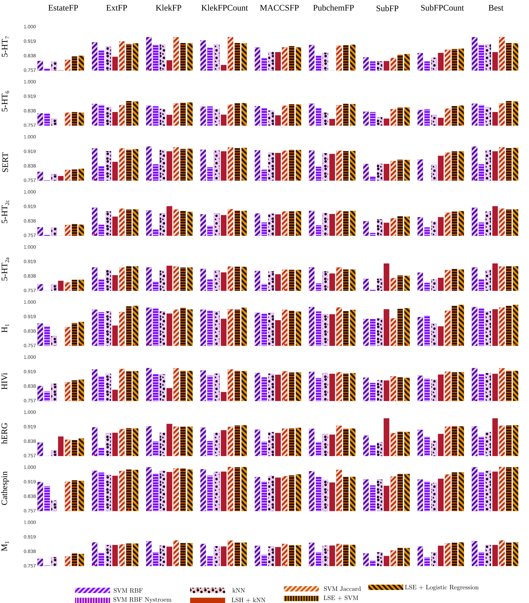

# Code for TFML 2015 conference paper

Supporting code for "Analysis of compounds activity concept learned by SVM using robust Jaccard based low-dimensional embedding" paper

</img>

## Setup

Change your `misc/config.py` file to match base directory and upload to data directory all .libsvm files

## Code organization

Scripts `fit_knn.py`, `fit_svm.py`, `fit_lr.py`, `fit_melc.py` are used to fit models. See `python fit_<model>.py -h` for usage.
Files in `scripts` folder were used to schedule many fittings, precalculate kernels for Jaccard etc. Each fitting script
writes experiment file that can be printed out.

## Fit new SVM

To fit svms run `python fit_svms.py`. 

```
Usage: fit_svms.py [options]

Options:
  -h, --help            show this help message and exit
  -e EXPERIMENT_NAME, --e_name=EXPERIMENT_NAME
  --kernel=KERNEL       
  --experiment_name=EXPERIMENT_NAME
  --seed=SEED           
  --use_embedding=USE_EMBEDDING
  --fingerprint=FINGERPRINT
  --n_folds=N_FOLDS     
  --protein=PROTEIN     
  --max_hashes=MAX_HASHES
  --grid_w=GRID_W       
  --K=K        
```

Example

```
python fit_svms.py --kernel=linear --use_embedding=1 --protein=0 --fingerprint=4 --e_name=my_favourite_experiment
```

## Print and plot results

```
python scripts/fit_svms_print_results.py my_favourite_experiment
```

